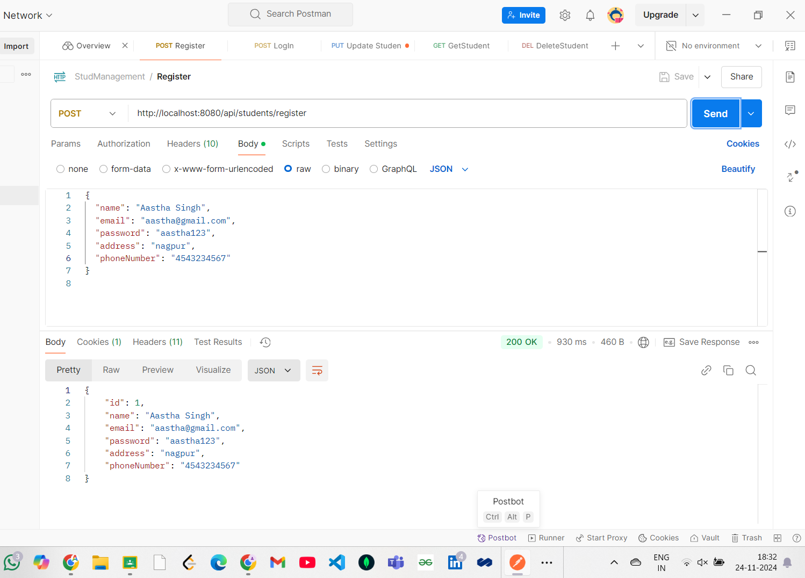
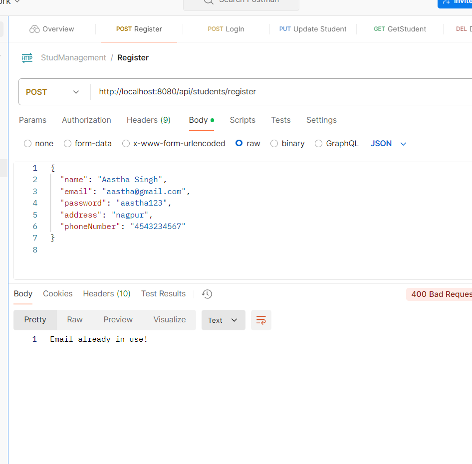
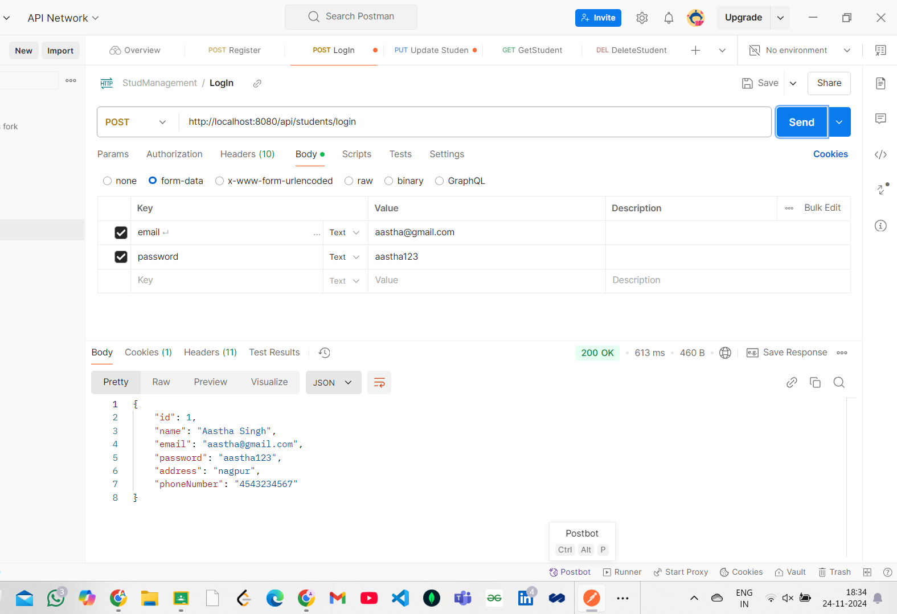
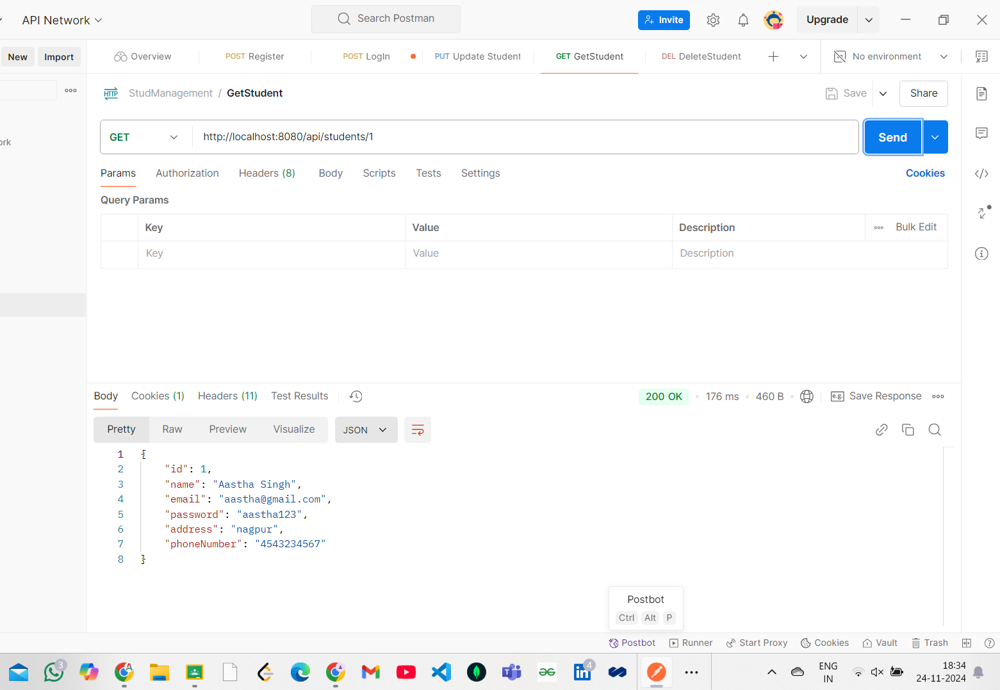
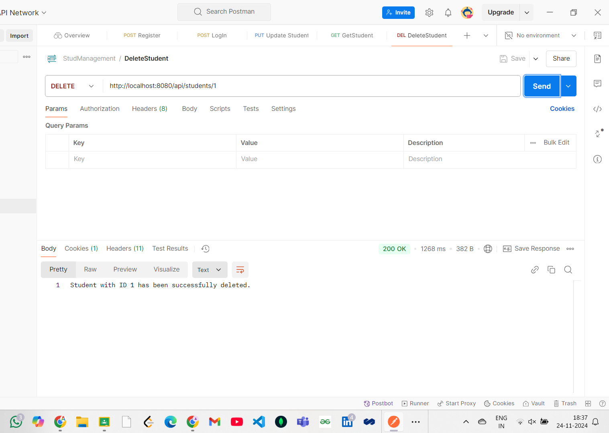

# StudentManagement

## Creating a Spring Boot Application and Testing the CRUD Operations in Postman

#### CRUD OPERATIONS

#### Register a new Student

#### Registering with existing email

#### Login with email and password

#### Fetching students details

#### Updating info Aastha -> Aastha Singh

#### Deleting the entry

