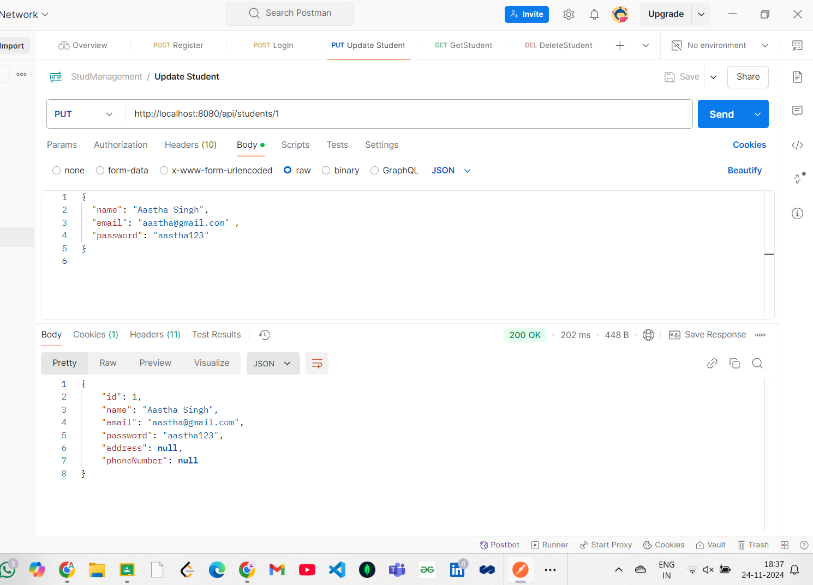
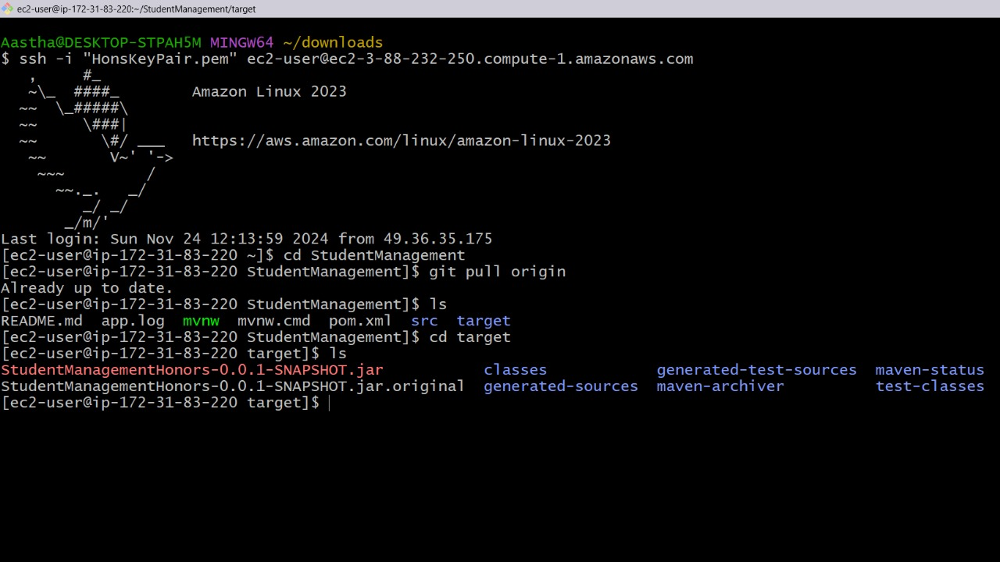
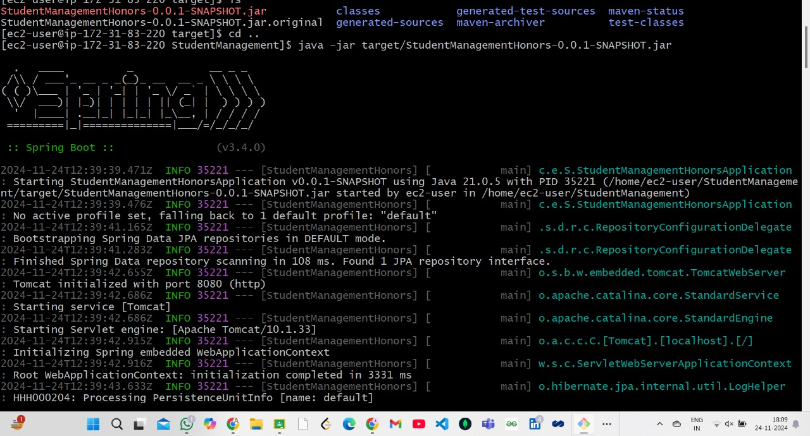

# STUDENT MANAGEMENT

### PART 1 Creating a Spring Boot Application and Testing the CRUD Operations in Postman

#### CRUD OPERATIONS

#### Register a new Student

#### Registering with existing email

#### Login with email and password

#### Fetching students details

#### Updating information sets address and phoneNumber black ana also other entities can be updated

#### Deleting the entry

### PART 2 

